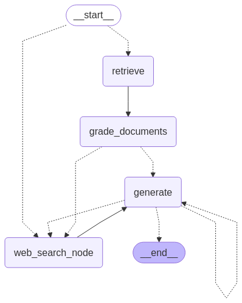

# LangGraph Agentic RAG Workflow

A simple self-correcting and hallucination-checking RAG (Retrieval-Augmented Generation) workflow built using LangGraph, running LLMs locally via Ollama.

## Features

*   **Retrieval-Augmented Generation (RAG):** Leverages external knowledge sources (web search via Tavily and a local vector store) to enhance generation quality.
*   **Local LLM Execution:** Uses Ollama (`qwen3:30b` by default) to run language models locally, avoiding reliance on external APIs for core generation.
*   **LangGraph:** Implements the workflow as a state graph for clear logic and execution flow.
*   **Vector Store:** Uses `SKLearnVectorStore` with `NomicEmbeddings` (local inference) for efficient document retrieval.
*   **Self-Correction:** Includes mechanisms to review and refine generated answers based on retrieved documents.
*   **Hallucination Checking:** Incorporates steps to verify the factual consistency of the generated output against source documents.
*   **Optional Caching:** Supports caching the vector store embeddings locally (`.parquet` format) to speed up subsequent runs (requires `pandas` and `pyarrow`).

## How it Works

This project uses LangGraph to define a cyclical process where:
1.  A question is received.
2.  The question is routed to either a web search (using Tavily) or the local vector store.
3.  Relevant documents are retrieved (from web or vector store).
4.  Retrieved documents are graded for relevance to the question.
5.  An initial answer is generated by a local LLM (via Ollama) based on the relevant documents.
6.  The answer is checked against the source documents for factual consistency (hallucination check) and relevance to the original question.
7.  If inconsistencies or irrelevance are found, the process attempts to self-correct (e.g., by performing a web search if not already done, or regenerating the answer) up to a maximum number of retries.
8.  A final, verified answer is provided.

## Setup

1.  **Clone the repository:**
    ```bash
    git clone <your-repo-url>
    cd langgraph-agentic-workflow
    ```
2.  **Install Ollama:**
    Follow the instructions at [https://ollama.com/](https://ollama.com/) to install Ollama on your system.
3.  **Pull the LLM Model:**
    Download the model used in the script (or choose another compatible one):
    ```bash
    ollama pull qwen3:30b
    ```
4.  **Install Python dependencies:**
    ```bash
    # Make sure you have pip or a similar package manager (like uv)
    pip install -r requirements.txt
    
    # OPTIONAL: For vector store caching
    # pip install pandas pyarrow 
    ```
5.  **Configure environment variables:**
    Create a `.env` file in the root directory and add your Tavily API key:
    ```env
    # Required for the web search tool
    TAVILY_API_KEY="your_tavily_api_key_here"
    ```
    *Note: `OPENAI_API_KEY` is not required as the LLM runs locally via Ollama.* 

## Usage

1.  **Ensure Ollama is running:** Start the Ollama application/server if it's not already running in the background.
2.  **Run the main workflow script:**
    ```bash
    python main.py
    ```

Follow the terminal output to see the agent's reasoning and the final answer.

## Workflow Graph

 